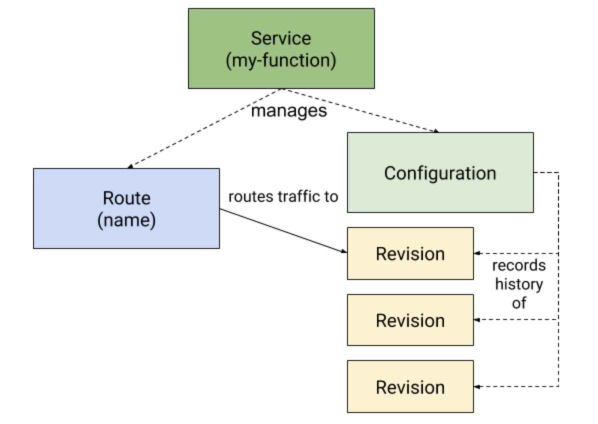

Knative `Serving` is composed of four resources:
* `Service`
* `Route`
* `Configuration`
* `Revision`

All of these resoruces are managed by the `Service` resource. A Knative `Service` automatically 
manages the whole lifecycle of your workload. It controls the creation of other objects to ensure 
that your app has a `Route`, a `Configuration`, and a new `Revision` for each update of the `Service`. 
`Services` can be defined to always route traffic to the latest revision or to a pinned revision.

An illustration of this is shown below:

The `Route` resource maps an endpoint to one or more `Revisions` of an application or function to 
help manage incoming traffic.

A `Revision` resource is a point-in-time snapshot of the code and configuration for each modification 
made to the workload. `Revisions` are immutable objects and can be retained for as long as useful. `Revisions`
help to archive the state of an application or function as it evolves over time.

The `Configuration` resource maintains the desired state for your deployment. It provides a clean separation 
between code and configuration. Modifying a configuration creates a new `Revision`.

In summary, the creation of a Knative `Service` results in the creation of a `Route` to provide an accessible 
endpoint for your Knative workload, a `Configuration` holds the current state of a Knative workload and a `Revision` 
to archive the current state of the Knative workload. Any change to the `Configuration` of the application will 
result in a new `Revision` to archive the change.

In the next section, you will see an actual Knative `Service` and create the `Service`.

Click **Knative Service** to continue.